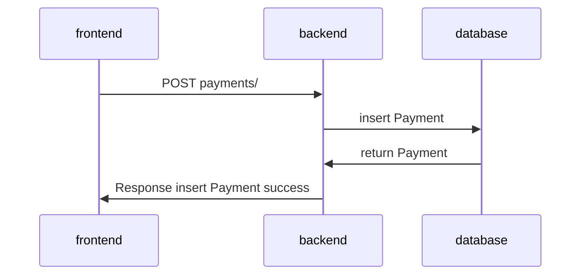

# Payment Add API
Create a new payment for user

## Specification
* **path**: /payments/
* **method**: POST

### Query Params
- No
### Request body
```json
{
    "user_id": 1,
    "method": "credit",
    "number": "1111222233334444",
    "name": "Human card",
    "payment_expiry_date": "0122",
    "secure_code": "123"
}
```

### Response body
```json
{
    "id": 1
}
```

## Sequence Diagram
