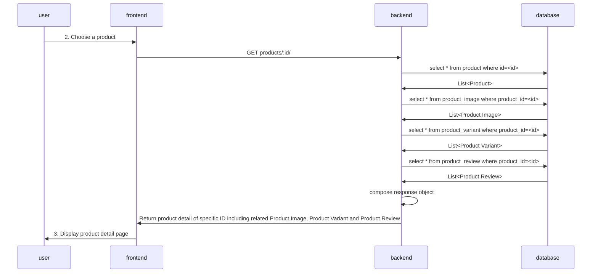

# Product Detail API
Return product detail of selected ID

## Specification
* **path**: /products/:id
* **method**: GET

### Query Params
-

### Request body
-

### Response body
```json
{
    "id": 1,
    "name": "POCA SHOE NMD Sneaker Fasion",
    "brand": "Poca Shoes",
    "category": "สุภาพบุรุษ",
    "description": "* สวมใส่สบาย",
    "price": 399.0,
    "product_image": [
        {
            "id": 1,
            "product_id": 1,
            "image_path": "/media/poca.jpg",
            "is_feature_image": true
        }
    ],
    "product_variant": [
        {
            "id": 1,
            "product_id": 1,
            "variant_name": "ขนาด",
            "variant_choice": "S",
            "is_default_choice": true
        }
    ],
    "product_review": [
        {
            "id": 1,
            "user_id": 1,
            "product_id": 1,
            "comment": "Banana is not apple",
            "rating": 5
        }
    ]
}
```

## Sequence Diagram
