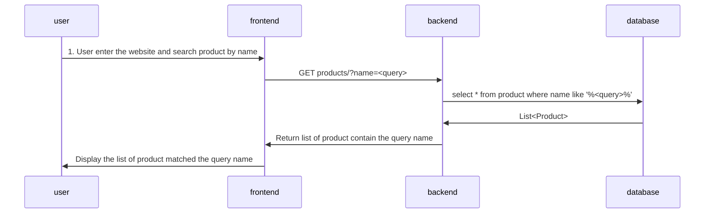

# Product List API
A product list API that return all product or filter product by name

## Specification
* **path**: /products
* **method**: GET

### Query Params
* **name (str)**: a product name can be user to search for example: Adidas NMD

### Request body
```json
-
```

### Response body
```json
{
    products: [
        {
            "id": 1,
            "name": "POCA SHOE NMD Sneaker Fasion",
            "brand": "Poca Shoes",
            "category": "สุภาพบุรุษ",
            "description": "* สวมใส่สบาย",
            "price": 399.0
        }
    ]
}
```

## Sequence Diagram
