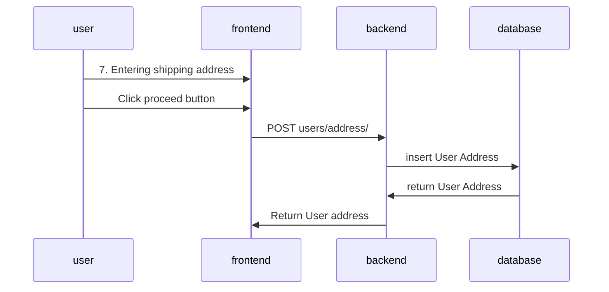

# User Address Add API
Create a new address for user

## Specification
* **path**: /users/address
* **method**: POST

### Query Params
- No

### Request body
```json
{
    "user_id": 1,
    "email": "human@email.com",
    "name": "Human address",
    "address": "12/34 example road",
    "postal_code": "10110",
    "district": "Chatuchak",
    "province": "Krung Thep Maha Nakhon",
    "telephone": "0812345678"
}
```

### Response body
```json
{
    "id": 1,
    "user": {
        "id": 1,
        "username": "yothinix"
    },
    "email": "human@email.com",
    "name": "Human address",
    "address": "12/34 example road",
    "postal_code": "10110",
    "district": "Chatuchak",
    "province": "Krung Thep Maha Nakhon",
    "telephone": "0812345678"
}
```

## Sequence Diagram
