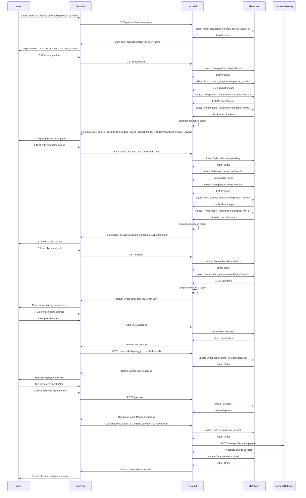

# Product Search and checkout flow
All screen mention in the API spec refer to [this document](https://github.com/up1/course_microservices-3-days/blob/master/slide/01-DESIGN-MICROSERVICE-WORKSHOP.pdf)

## Description
In this flow, The user will search for product by name. Then the customer will select the product to view detail such as Product image, the review average and the product price. After the user review they will click "ใส่ตระกร้า" and the system will navigate to display the detail of previous add product and the check out button name "ชำระสินค้า"

When the user click on the checkout button the system will prompt user to add a shipping address which contain email, the user full name, address, postal code, district, province and telephone number. In this shipping address screen the user also saw an order summary and a next button label as "ดำเนินการต่อ" which will add the shipping address to the order and navigate to the payment detail page.

In the payment detail page user will have an option to select payment method for order from credit card, debit card, and line pay. when the user select one of the payment method it will display the payment detail form for example credit card will display the card number, card holder name, card expiry date and card secure code. The user also can view the address they add on the previous step and the order summary in this screen too. When they finish add the payment detail the user can click the purchase button label as "สั่งซื้อสินค้า" then the system will call the payment gateway to charge the customer and update the order status to be paid. 

When the backend process complete it will redirect the user to the summary page which will display the invoice number, the payer, transaction date, expired transaction date, payee and other detail. It will also display the total amount of the order as well. In this step the user has finish the purchasing and can wait for the product to ship to their address.
